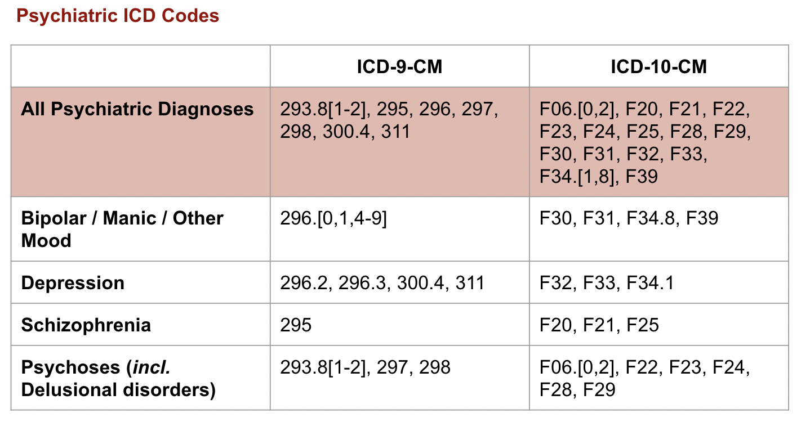
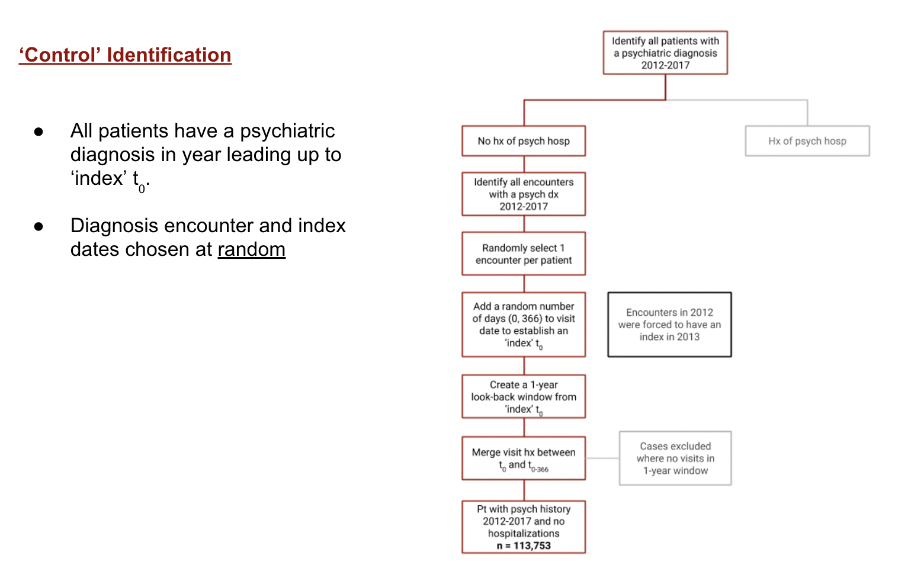
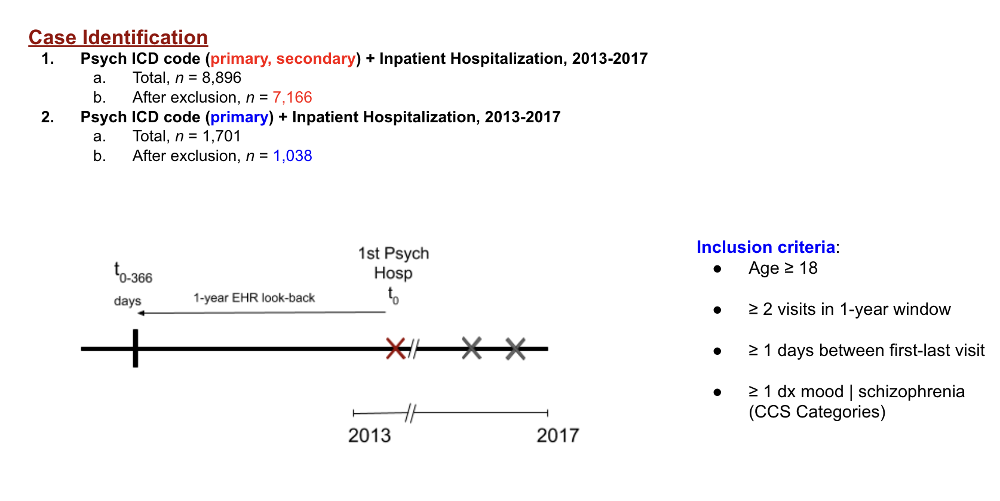
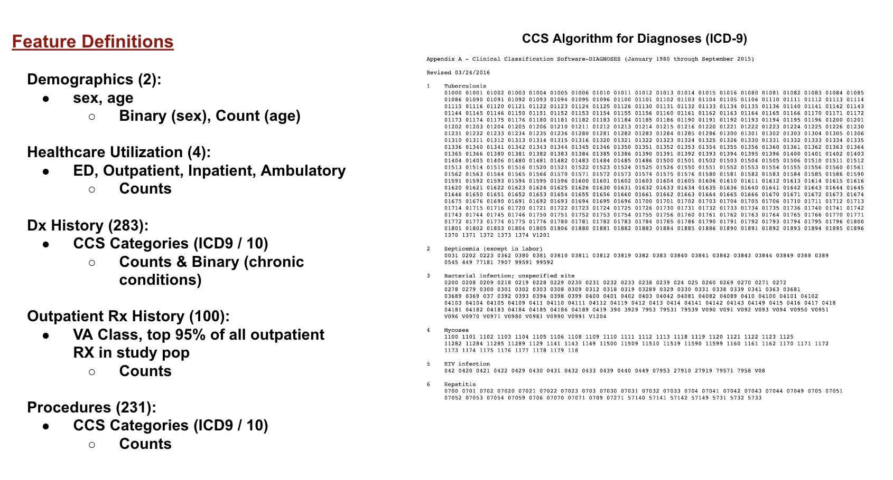

# Incident Psychiatric Hospitalization Prediction

## Summary

* This repository contains code to predict incident psychiatric hospitalization (bipolar/manic disorders, depression, schizophrenia, psychoses/delusional disorders), using a 1-year study window.

* Time period : Time period: 01/2013-12/2017
* Study Design: Retrospective case-control

* Data Source: CDRN [OMOP] (https://www.iqvia.com/solutions/real-world-evidence/evidence-networks/ohdsi-omop?utm_source=google&utm_medium=cpc&utm_campaign=2022_OMOPgads_GBU_RWS_RS&utm_content=149721603744&utm_term=omop&gclid=CjwKCAjwrdmhBhBBEiwA4Hx5gyLkdbAZTv4dvzPUb6m_o8TBYj-bd-QxpD5C9O6zbUzPliGoC1GpsxoCcncQAvD_BwE)

### Population: 
  Potential Cases: 470,242 pts with hx of depression Dx or antidepressant Rx
  Potential Controls: 1,000,000 pts with no hx of psychiatric Dx or antidepressant Rx

   
   
   
   
